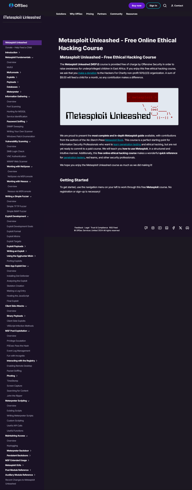

# Metasploit Free Online Ethical Hacking Course

---

### I recently completed the Metasploit Unleashed Free Online Ethical Hacking Course at https://www.offsec.com/metasploit-unleashed/. 

#### The Metasploit Unleashed (MSFU) course is the most comprehensive and in-depth Metasploit guide available, with contributions from the authors of the No Starch Press Metasploit book. It’s an excellent starting point for information security professionals looking to learn penetration testing and ethical hacking. 

#### Throughout the course, I learned how to use Metasploit in a structured and intuitive way. Additionally, this free online course serves as a great quick reference for penetration testers, red teams, and other security professionals.
  
---

